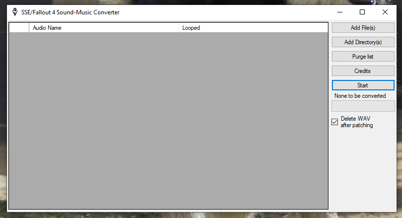

# SSE-Fallout-4-Sound-Music-Converter
Check the changelog.MD for more info
This tool can be used to convert given audio files (.xwm/.wav) to PS4 format

Requirements:

at9tool.exe found in the PS4 SDK ("Can't give a link sorry")

though if you have it extract it than got to "InstallFiles\[55]" extract the zip file givin and you got your tool.
you got it installed? even better got to "C:\Program Files (x86)\SCE\ORBIS SDKs\4.500\host_tools\bin"
copy "at9tool.exe" and paste it into the data folder
wile your here grab a few others for the other tools
"orbis-image2gnf.exe" "libSceGnm.dll" "libSceGpuAddress.dll" "libSceTextureTool.dll"

xWMAEncode.exe found in the DirectX SDK ("https://www.microsoft.com/en-us/download/details.aspx?id=6812")

How to install the required files:

step one(1): copy all the required files to the "Data" folder

How to use this tool:
Get the .wav/.xwm files (or folder which contains these files).
When adding the .wav/.xwm to the tool you have a couple of options, you can click the "Add Files" button to add multiple files by hand, you can click "Add Directory..." which will search the directory you choose for .wav/.xwm files, or you can drag the folder containing the .wav/.xwm files onto the app and it will automatically scan and detect .wav/.xwm files.
(Optional) Check the checkbox below the progress bar if you would like/would not like the .wav/.xwm to be deleted after the .at9 conversion, by default this is checked.
(Optional) If the .wav/.xwm is looped audio click the loop check mark next to the audio file.
Once you have gotten the .wav/.xwm files of your choice onto the too click "Convert" and wait for it to be finished.
Done! Now you can enjoy converted sound/music!
Questions and answers:

Question: What is this tool for?
answer: This tool converters .wav/.xwm files to AT9(ATRAC9)

Question: Do I need to use .at9?
answer: Yes, .wav/.xwm will NOT play for Skyrim or Fallout 4 on PS4.

Question: This tool just produces a .at9 with 0 bytes, what happened?
answer: Rarely the tool can fail converting a .wav/.xwm, in this scenario I recommend to re-process the .wav and try again. If there is failure turning the .xwm into a .wav then it may not actually be a .xwm file.

Question: Do I need to rename the .at9 file back to .wav/.xwm?
answer: NO, this is not needed.

Question: What is the loop check mark next to the .wav/.xwm files?
answer: Certain audio files loop in mods, if you find the .wav/.xwm file says "loop" then good chance it loops the audio and that check mark would need to be checked.

You are done use the tool as you wish

